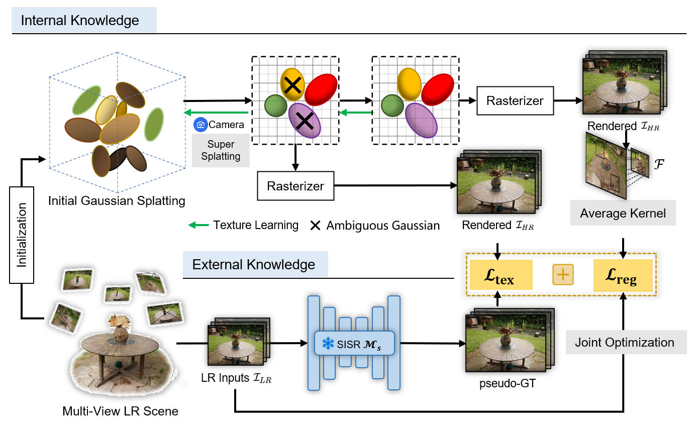

# SRGS: Super-Resolution 3D Gaussian Splatting

> Xiang Feng, Yongbo He, Yan Yang, Yubo Wang, Yifei Chen, Zhan Wang,Zhenzhong Kuang, Feiwei Qin, Jiajun Ding
>
> Hangzhou Dianzi University.
>

## Overview


Overview of the proposed method. SRGS utilizes both external and internal knowledge for joint optimization. The radiance field is optimized in the HR space using the super-splatting method. The external knowledge from the pre-train 2DSR model is used to construct pseudo-GT for high-resolution supervision. The internal knowledge from well-structured existing views facilitates ambiguous Gaussians to learn view-consistent geometry construction.


## Citation
If you consider our paper or code useful, please cite our paper:
```
@article{feng2024srgs,
  title={Srgs: Super-resolution 3d gaussian splatting},
  author={Feng, Xiang and He, Yongbo and Wang, Yubo and Yang, Yan and Li, Wen and Chen, Yifei and Kuang, Zhenzhong and Fan, Jianping and Jun, Yu and others},
  journal={arXiv preprint arXiv:2404.10318},
  year={2024}
}
```

## Contact
If you have any questions or suggestions about this repo, please feel free to contact xiangfeng@hdu.edu.cn
